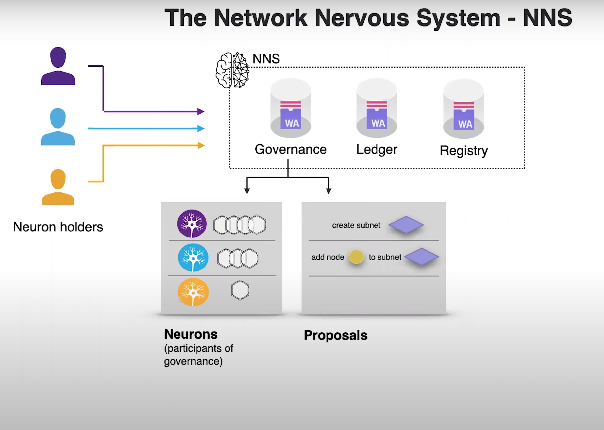
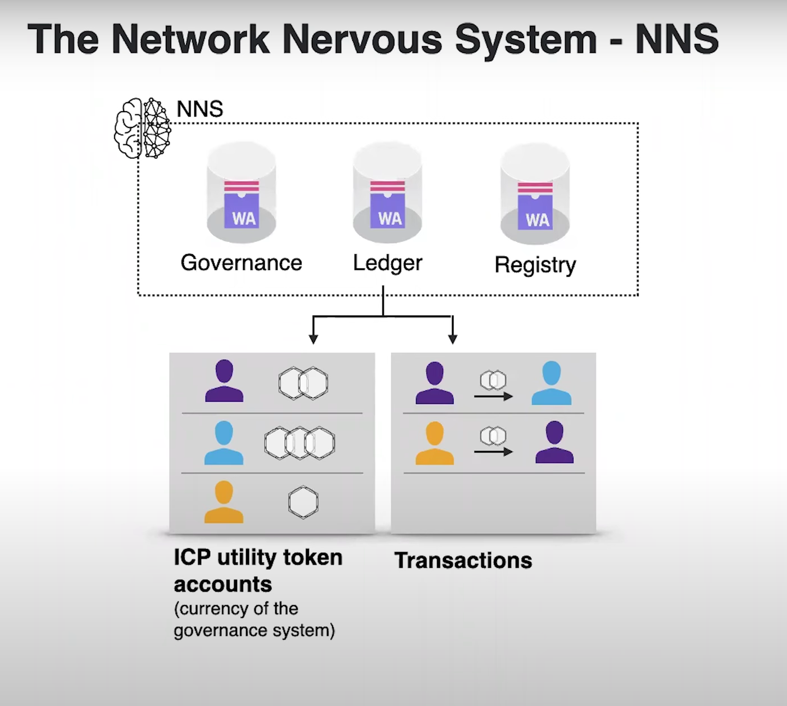
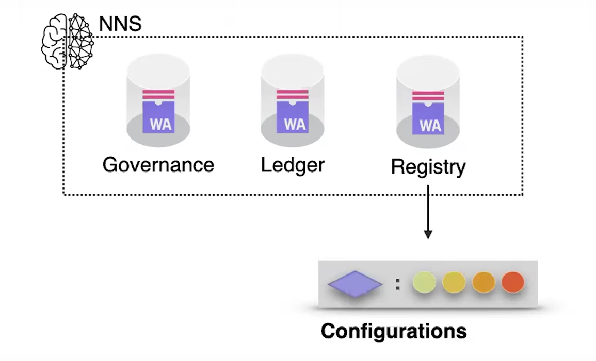
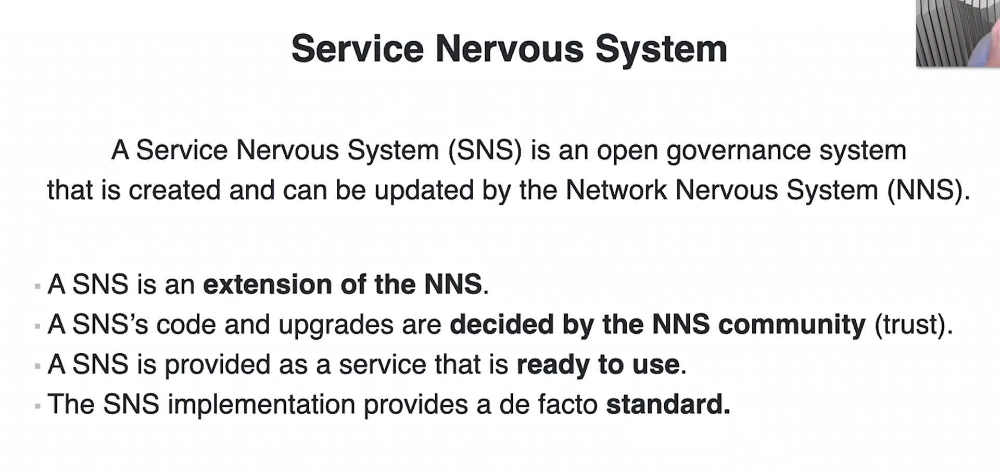
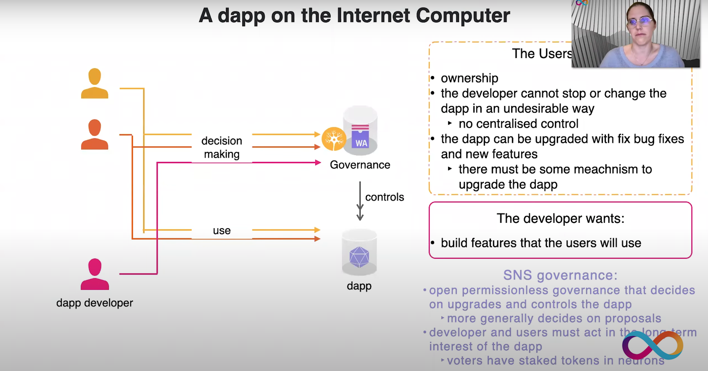
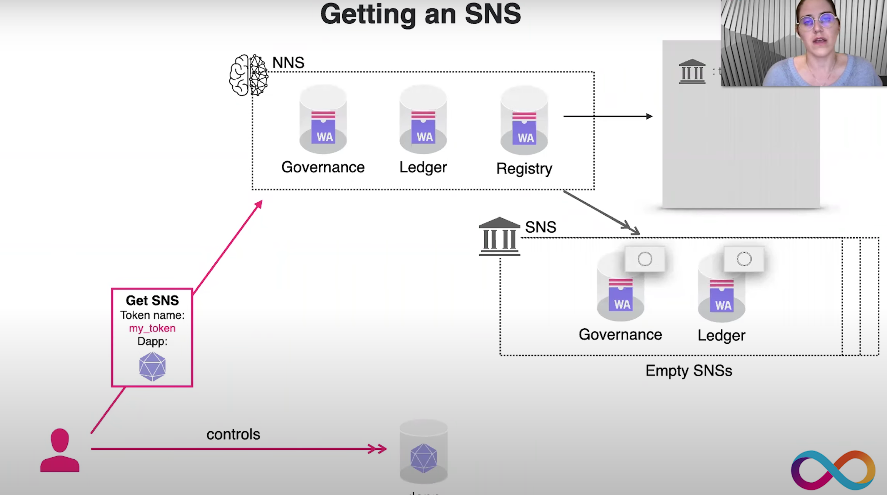
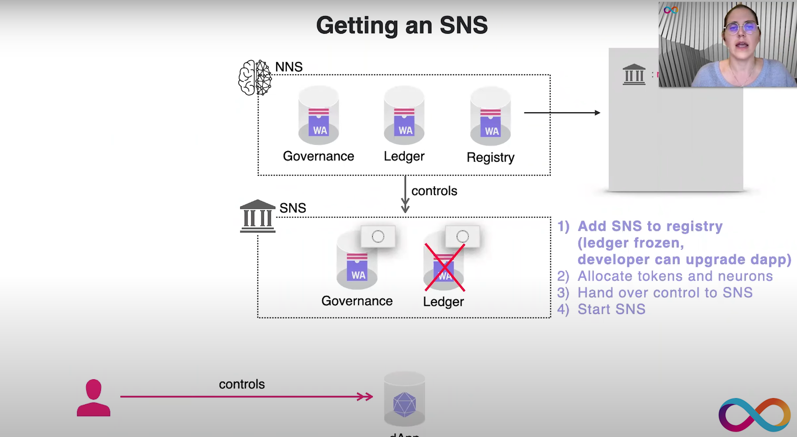
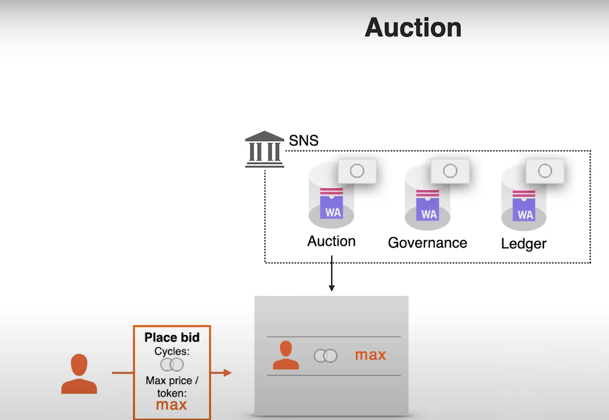
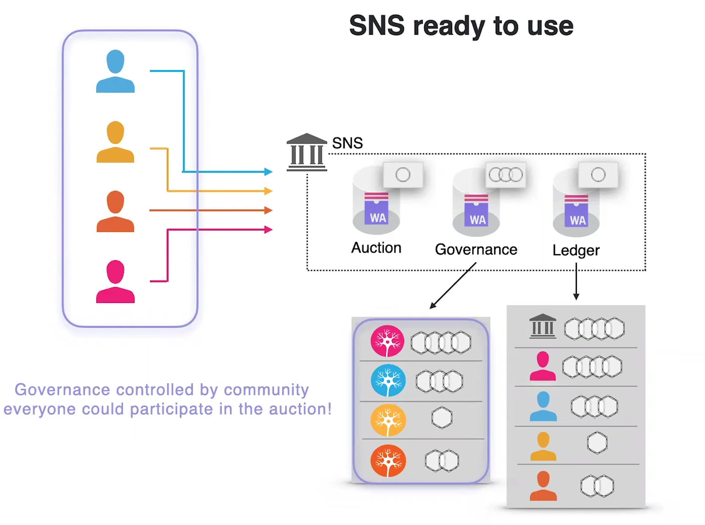
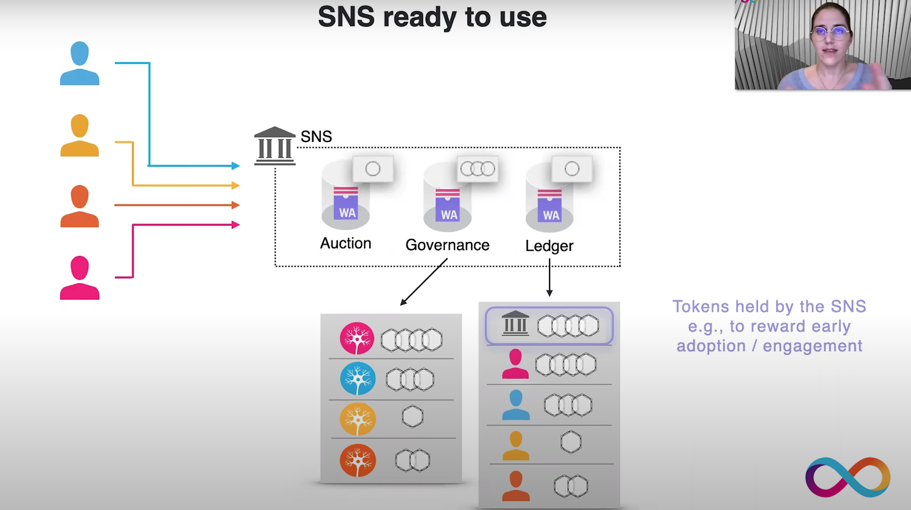

### SNS ： Service Network System - DAO治理组件

* Forum : [Reference](https://forum.dfinity.org/t/service-nervous-system-governance-for-dapps/6151)
* 主要推动人物 ： David Ribeiro Alves，Lara Schmid (@Lara) ,@johan（Forum）
* 针对对象 ： 为DAPP建立 DAO & Token 基础设施
* 官方介绍&讨论视频 ：[Reference](https://www.youtube.com/watch?v=L4443aaAP5A)

### NNS 与 SNS

#### NNS ：

NNS Canister的三个功能 ： Governance， Ledger， Registry

投票： 神经元投票

Ledger Canister： 存储交易信息 

Registry Canister： 配置节点和子网：

目前来看， 官方眼中的SNS是NNS的一种拓展， NNS管理IC， SNS管理DAPP。但是NNS是SNS的上级。

NNS 与 SNS的关系：

* SNS 是 NNS的一个拓展
* SNS 的代码和升级需要由NNS投票控制
* SNS 是一个开放服务， 相当于IC提供的服务（我觉得可以不用这个服务）
* SNS 的实现提供了标准（DAO， Token等）

#### SNS

* SNS 简述
* SNS Canister 机制设计
* SNS Token 机制设计

SNS简述 ： 

​	SNS的目的是构建一个无许可的去中心化管理组织（Governance System）， 	让DAPP的用户， 开发者， 投资者共同管理DAPP， 决定DAPP未来的特征。

SNS Token ： 

​	SNS Token可以用Cycles兑换， 由于SNS Token可流动， 因此SNS Token可以兑换为Cycles。 即双向兑换 ： SNS Token <=> Cycles

* 部分SNS Token 需要锁定到神经元中， 以让购买Token的人共同为了DAPP的发展而努力， 相信这个token未来仍然是有价值的， 并且为了SNS的未来价值而努力。
* 创建的管理生态是 ： 开发者， 用户， 投资者共治 ：

#### SNS Canister 机制设计：

SNS Canister 分为两个主要的Canister类型：

* Governance Canister 治理Canister ： 升级DAPP的代码， 对DAPP Canister进行一系列操作等
* SNS Ledger Canister ： 存储SNS Token的交易信息（不是ICP 的 Ledger， 不同的SNS有不同的Ledger）。

与NNS Canister不同的是， SNS Canister 消耗 Cycles

猜测 ： 参与SNS的用户应该会在nns.ic0.app中的神经元模块显示你参与到哪个SNS

DAPP申请SNS的流程 ： 

* 开发者向NNS发起提案申请： 提案包含SNS Token Name， 要被赋予SNS的DAPP信息。

* NNS接受并且通过提案后， NNS会创建一个空的SNS Canister ， 这个时期， Ledger Canister是被Frozen的， 并且开发者仍然可以控制Canister， 包括修改代码， upgrade等
* 

*  当开发者准备好后， 启动SNS Canister： 开放Token 和 治理权限， Canister Controller将会从Developers转移到SNS。当这些都完成后， Ledger Canister会开放。

#### SNS Token 机制设计

* Token分配
* Token拍卖
* Token <> 神经元

Token分配演示 ：

假如 1 Billion SNS Token， 25%分配给开发者，  35%分配给SNS Governance， 40给投资者。

* P.S. 图中分配方式只是演示， 并没有说Token分配模型是这个， 根据Forum上的信息， 这个分配额度是可以被修改的， 官方没有说明这个Token分配是固定的
* Token支持通货膨胀。

Token拍卖 ：

拍卖流程 ： 

​	Token发布后，  份额将通过Auction Canister进行拍卖， 每个User可以出自己的价格（Cycle）， 当拍卖截至日期后， Auction Canister会决定最终价格（并非最高为准）， 让所有人根据同一个价格买到token。这些cycle会汇给SNS Governance Canister。（拍卖的Token为投资者的Token）

90 % 的Governance Token会被锁到神经元中， 以保证Token的长期价值。 10%的流动性让市场能做起来。

#### Token <> Neuron

左边的是Neurons， 今后所有的Dapp的升级之类的操作都需要Neurons投票进行。 

SNS 的 Token可以用来奖励DAPP早期的参与者和用户。

### 最终呈现

NNS <> SNS <> DAPP

NNS管理SNS， SNS 管理 DAPP。SNS支持多Canister应用。

#### 社区观点

* NNS与SNS交流 [主要观点](https://forum.dfinity.org/t/service-nervous-system-governance-for-dapps/6151/5?u=c-b-elite)： 
  * SNS应主要关注DAPP的安全性（操作安全， 代码安全等）[reference](https://forum.dfinity.org/t/service-nervous-system-governance-for-dapps/6151/5?u=c-b-elite)
  * SNS的合规合法： 出现严重社会问题时， 可以通过NNS投票强制停止DAPP， 并且通知该DAPP的SNS。（我认为这对追求资产去中心化的人来说， 这是不可接受的， 但是对于应用来说， 或者对政治影响来说， 我认为这是一个利好）
  * 合规合法2 ： 内容合法， DAPP不用于非法内容
* SNS投票不一定要基于Token， 可以实行不同的治理方式（政治化）
* SNS应该放开设计， 不应该都用一套复杂模板（有人认为）

#### 社区意见

* SNS应该和NNS不一样， 可能有人认为NNS比较中心化（现在）， SNS应该是更为去中心化的。这个意见的支持者比较多， 都认为SNS和NNS应该不一样，不同的DAPP应该有不同的看法和拓展。 
* 涉及法律和政治方面的讨论多一些， 比如种族主义， 色情暴力等

#### SNS 提案将考虑的事情：

* 从NNS系统中抽象出SNS系统（Canister设计， Ledger 设计）
* 是否重构NNS
* NNS与SNS的关联
* SNS代码设计

* Token 标准， IC的Token标准可能会和为SNS准备的Token标准重叠（暂不确定）

#### 目前进展

* SNS团队成员包含NNS成员， 目前正在讨论阶段[Reference](https://forum.dfinity.org/t/service-nervous-system-governance-for-dapps/6151/16?u=c-b-elite)

* 'Domic 7月底（2021.7.28） 在 Tweet上发SNS的研发可能需要2 - 3 个月[Reference](https://forum.dfinity.org/t/service-nervous-system-governance-for-dapps/6151/17?u=c-b-elite)
