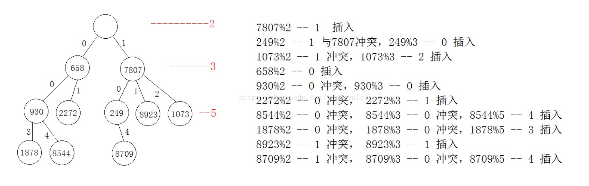

= HashTree

基础HashTree：
首先，有一个素数生成器，从2开始，到无限

插入：
每个元素插入 (K, V) -> Tree
首先，从2开始，设素数为P， 取 K % P = 插入位
如果P = 2， 那么 3 % 2 == 1， 即插入到2节点下的1这个位置， 每层节点可以有下一个素数个子节点
比如2这个节点下，可以有3个子节点

查找：
根据取余依次查找， 最后对比

删除：
将节点的"占有"元素改为false即可

结构体：

[source]
----
struct Node
{
keyType      key ;
ValueType    value ;
bool         occupied ;    //用occupied来表示节点是否被占据。如果节点的关键字（key）有效，那么occupied应该设置位true，否则设置为false。
struct Node* subNodes[1] ; //我们用subNodes[i]来表示节点的第i个子节点的地址。
----