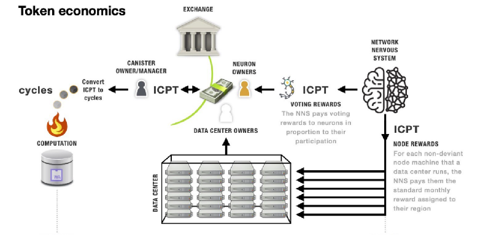
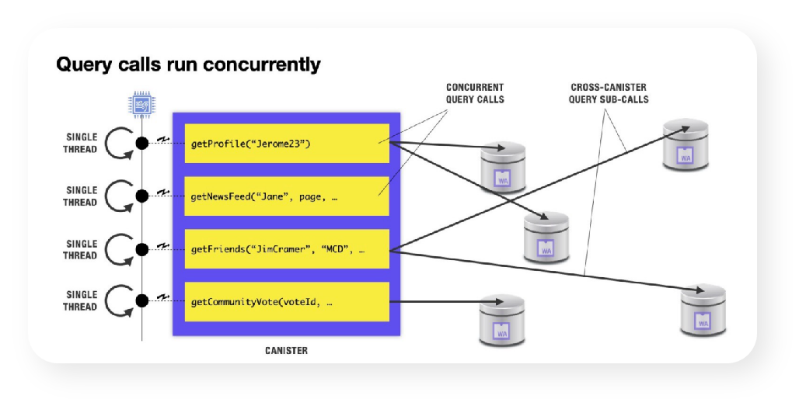
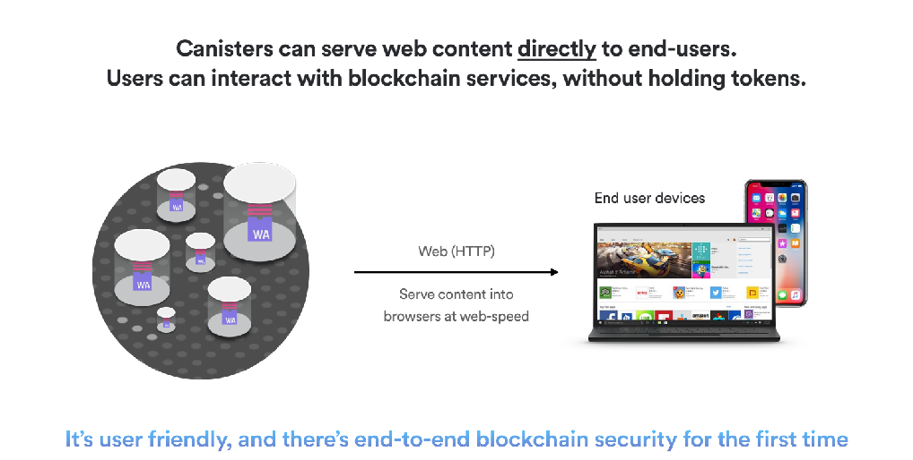
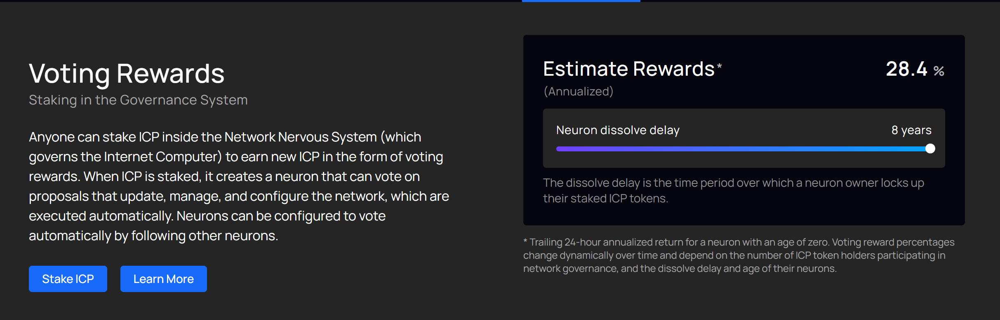
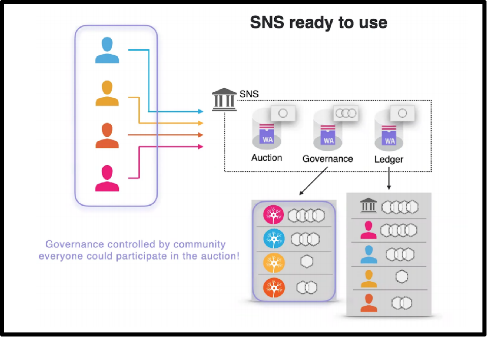
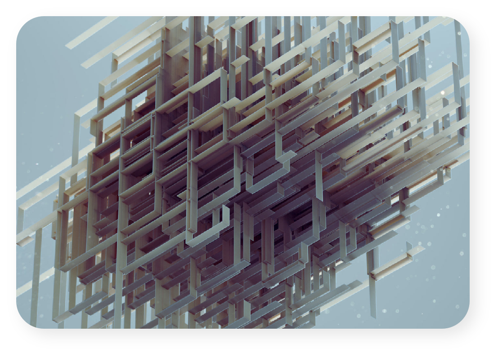

Internet Computer Protocol Introduction

I will introduce the following aspects

* What is Internet Computer :  One word summary
* Team Presentation
* Goal of ICP Blockchain
* The advantages of developing on the Internet Computer Blockchain
* Overview Of ICP BlockChain Technology
* RoadMap

## What is DFINITY  Foundation ：

* One word summary of DFINITY and ICP Blockchain technology :

​		DFINITY stands for DFINITY Foundation, the ICP Blockchain Foundation.

​		The goal of DFINITY Foundation is to create a truly “ World Computer ” with high performance, decentralized, infinitely, scalable features to achieve a new generation of Internet technology revolution, which is the ICP protocol.

## Team Presentation ： 

The original origin of DFINITY came from a project incubated by String Labs.

The team includes the current top scientists in the blockchain and engineers from Google, Amazon, IBM and other well known companies

## Goal of ICP Blockchain

* DFINITY wants to create a virtual super-host of the world’s data centres, abstracting a decentralized super-virtual cloud over traditional cloud vendors such as Alibaba Cloud and AWS.

## The advantages of developing on ICP Blockchain

* Both frontend and backend code of the application runs on the chain node, which means that the application’s front-end code is also secured by the ICP blockchain.
* Any programming language that can be compiled to WASM(WebAssembly) can develop the canister smart contract, such as golang , C++, Rust, typescript, javascript, etc.
* Less code, less costs but more security and functionality.

## Overview of ICP BlockChain Technology

### Token - Economic 

* Cycles : 
  1. The value of cycles is anchored to the [XDR](https://www.imf.org/external/np/fin/data/rms_sdrv.aspx), which is a stable coin synthesized from a series of coins by weighted summation.The main function is to recharge the Canister and keep the Canister running on ICP blockchain.

* ICP

  1. Can be converted into a Cycle, “Recharge”to Canister (smart contract container) , maintain the operation of Canister.

  2. You can stack ICP Token as a neuron in [nns wallet](nns.ic0.app). As a neuron, you can vote to participate in the governance of the ICP network. Voting will lead to the new ICP Award.

### Canister  - A new generation of smart contracts:

* Canister is a new type of smart contract that is more powerful than the Ethereum smart contract. Each Canister has a 4 gigabytes runtime memory and 4 gigabytes  persistent memory.

* Canister uses the Actor model, which allows canister smart contract can process transcation concurrently. There are two types of canister smart contract function : shared(update) and query. The shared(update) function transcation will be processed one by one but query function transcation can be handled concurrently.

* Update: this method modifies the state of the memory data, requires consensus within the subnet nodes, and processes the transcation message as a single thread.

* Query: Canister uses the Actor model, where each Query method takes a “memory snapshot” of the current data state within the node, and then performs any complex operation. Calls to this method do not modify the data state and can be processed in parallel.

* Canister can be upgraded, which is optional. The Canister smart contract can be upgraded by the canister smart contract controller so that the data state before and after the upgrade can be persisted without loss.

### Reverse Gas Model

* Users can access the new generation of  decentralized web services provided by the blockchain without a wallet. Canister’s Cycle consumption should be provided by the dapp service provider.

### Programming Language

* ICP native smart contract programming language is Motoko, which syntax is similar to TypeScript. But canister is essentially WebAssembly so that any language that can be compiled to WebAssembly can write the ICP smart contract. Rust cdk(canister development kit) is currently mature.

### Subnet

* The ICP blockchain contains a number of peer-to-peer subnets, the main types of which are System subnets and Application subnets, each of which is a separate blockchain. Dapps can be deployed to any of the application subnet, where each node runs a copy of the canister smart contract replica to enhance the capabilities and security of the Canister.

### Net Nervous System

* NNS is a special Canister contract on the System subnet, which is mainly responsible for the approval of joining nodes, the generation and reorganization of IC subnet, and the upgrade of ICP protocol. We can stack ICP Token to get a neuron to vote in the NNS.

### Chain Key

* Chain Key technology is one of the core technologies of ICP blockchain. Chainkey uses threshold BLS ciphers algorithm to service the ICP consensus protocols so that each subnet can quickly reach consensus. The technical underpinnings provided by Chainkey enable the frontend to verify that the message is sent by IC but not any hackers or anonymous sender.

### Catch up package - A blockchain that does not retain old blocks

* The data state of each subnet will be “Packaged” every 200 blocks, which will contain the consistency data state of all the current copies, the package will be signed by threshold signature (BLS) . After the data state certificate process, subnet  will delete the old block. Catch up packages can be used to recover data, synchronize data, reorganize subnets, and more.

### Internet Identity

* Internet Identity is a special canister on the system subnet that provides decentralized identity, which we called DID, services to users. With Internet Identity (II) , users can register all Dapps at once, and use delegation signature algorithm, session key , web authentication and other techniques to assign different addresses to different dapps to protect their privacy, to avoid detection.

### More details

* more details about technology of ICP blockchain can be found in the link : https://dfinity.org/howitworks

## Road Map

### SNS - Service Network System

* The DFINITY developer team will roll out SNS governance systems to create a new generation of DAO governance systems for DAPP on the ICP blockchain. SNS will provide Token Ledger management, DAO voting governance, and Token auction to help developers build their own DAO governance faster and better.

### Chain Key with Threshold ECDSA

* The DFINITY developer team is currently developing and testing threshold ECDSA solutions that enable Canister smart contracts to hold, send, receive bitcoin, and load smart contracts for BTC via ChainKey technology, make the ICP a truly new generation of internet computer.

### Canister Stable Storage

* Canister is constrained by WASM32, and its current runtime stack memory is 4GB, which is optimized by the ICP development team :

  Each Canister can have 4 gigabytes of persist stable memory in addition to the wasm runtime 4 gigabytes memory, which can be interpreted as hard disk memory (the current scenario is 8 GB Stable, but the current API can only get 4 gigabytes) , and canister’s stable memory can be expanded to a maximum of 300 gigabytes in the future.

### More details

* more details about the roadmap of ICP blockchain can be found in the link : https://dfinity.org/roadmap

