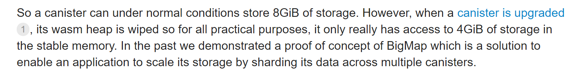
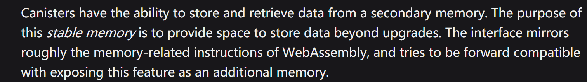
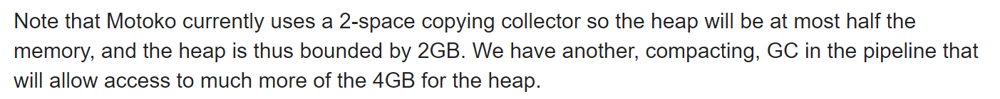
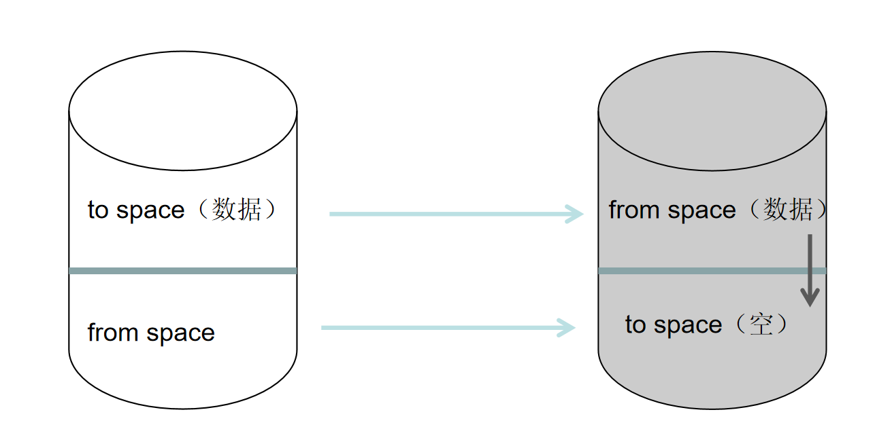
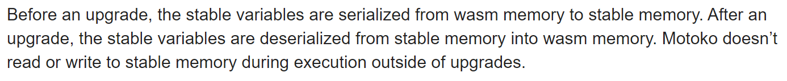
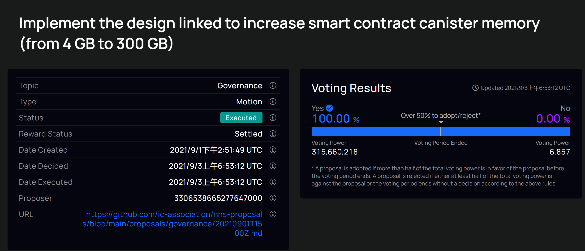
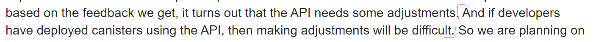
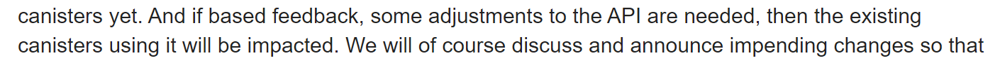
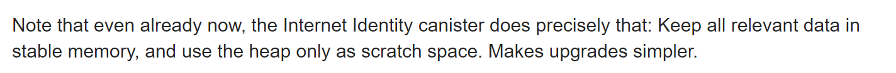

# IC 存储 

## Canister

* 12G&8G & 4G & 2G & GC ： 

  * 12G :

    * Canister的总体内存包含wasm run time 和 stable memory，对一个Canister而言， 前者为4G，后者为8G（以后可继续拓展最大为300G）
      * 
    * 由于wasmtime是32bit的指针地址域，因此是4G，而stable memory需要和wasm time适配， 所以也是4G，现阶段IC经过升级，stable内存可以拓展到8G， 可以简单的理解为此次升级是在Canister和stable memory内存之间加了一个中间件， 让32bit的wasmtime可以使用8G的stable内存（实际上是扩容到了16T， 即64bit， 但是官方此次仅提升到8G）
      * 
    * 8G 的stable内存（内存模型遵循的是WebAssembly的内存模型）
      * 
    * 4G 的堆内存（GC限制）

  * 4G （这里说的是Canister堆内存）： IC在进行技术选型时， WASM尚未开发出64 bit 的虚拟机， 因此当时采用了32 bit的WASM虚拟机， 造成现在单体Canister的内存为4G.

    * 2G ： wasm 单体的内存空间为4G， 但是由于Motoko所选用的GC（Garbage Collector 垃圾回收）算法为Copying 算法[1]， 造成由Motoko写的Canister只能使用2G内存空间

      

    * [1] Coping Collector Algorithm （也称为Minor GC）： 

      * 简述该算法在WASM Canister中的应用：
        * 4G 的Canister被划分为两个区域 ： from space & to space， 分别占用2G； 数据写入时， 所有的数据都在to space中。
        * 在进行dfx canister install xxx(default : --all) -- mode upgrade的时候， 会进行GC，即：将活动对象（正在使用的对象，可以是引用也可以是元数据）所在空间换为from space， 原from space换为to space， 然后对from space（数据所在的内存空间）进行遍历， 将所有的活动对象迁移到新的to space中， 剩下的就是非活动对象， 也就是内存垃圾， Canister会将这部分数据清理掉。
        * 
        * 优势
          * 内存使用率很高，写数据时是对堆进行连续写入， 所以利用率更高 。适用于快速增删数据的场景。（现在Java的JVM等新一代VM都一定程度上采用了Minor GC）
        * 缺陷： 
          * 浪费了一半的堆内存空间，可能会使用Compacting GC算法， 这个算法不会占用一半的内存来进行GC，可以使用全部的WASM内存
        * 对4G stable内存进行读写仅发生在upgrade过程。
        * 
          * 劣势： 当堆内存在升级时有大量要写入stable内存的数据时， 可能会将cycle消耗完， 导致无法升级。 
        * 触发时间：清理heap内存，在函数里面对全局变量进行了修改并不会被gc掉，因为外部有调用（全局变量），但是在升级的时候如果没有stable，就会被删掉。gc触发时间是在新生成的变量所           需内存大于已有的变量（2G-已用内存）或者当前已用内存大于2G时。

    * [其他GC的算法](https://blog.csdn.net/stinge/article/details/84022369?ops_request_misc=&request_id=&biz_id=102&utm_term=2-space%20copying%20collector&utm_medium=distribute.pc_search_result.none-task-blog-2~all~sobaiduweb~default-0-84022369.nonecase&spm=1018.2226.3001.4187)
    
  * 因此， 每个Canister的全部内存加起来一共12G（8G stable + 4G RTS Memory）

## Compacting GC：

压缩算法概述 ： 不划分WASM运行时内存， 即Canister除RTS占用的内存外， 都是heap内存 -> Canister : 4 G

* 首先，遍历heap， 找出所有的活体对象（正在活动/被活动的对象引用），  标记活体对象。标记完后剩下的就是不被引用或者不再使用的对象， 即内存垃圾。然后，清理Heap内存并将活体对象前移。 
* 

* 绿色是未使用内存， 蓝色是存活对象， 灰色是内存垃圾， 白色是可用内存

## Motoko GC Algorithm 选择：

对执行效率要求高， 但是不存储数据的Canister， 建议选用Coping GC(Minor GC)，即当前的gc。

对执行效率要求不高， 存储数据（或存储索引数据），或者Canister中保存的活体对象比较多的情况下， 建议用Compacting GC。 Compacting GC消耗的Cycle比Coping GC多。

#### Compacting GC & Coping GC 比较

[Reference](https://github.com/dfinity/motoko/issues/2033#issuecomment-842379468)

### Canister 存储数据的三种方式 ：

* 运行时：
  * 在编译时就写在WASM（Canister）中的静态变量
  * WASM Heap（堆内存）
* Stable内存：
  * Motoko可以在升级时与Stable内存交互， 未来会增加运行时与Stable内存交互的API（等待）
  * Rust可以在运行时和Stable内存进行交互， 正在研究。

## 存储提案

Forum讨论 ： https://forum.dfinity.org/t/increased-canister-storage/6148/67



提案内容： 提供一个系统API， 使每个Canister都可以使用子网所有的内存空间， 所有的副本都有自己的数据状态，即并非所有副本共用一个数据状态（这很好理解， 如果这样， 那就会出现并发问题，需要锁或者通道机制来避免冲突， 但事实上子网内使用的是共识来保证数据一致性）。

新增的System API （面向Canister与）：

github ： https://gist.github.com/ulan/8cc37022c72fe20dc1d57fdfd0aaf1fd

* ```rust
  ic0.stable64_write: (offset: i64, src: i64, size: i64) -> ()
  ```

  * 这个API接口是为了WASM 64进行提前准备的

* ```rust
  ic0.stable64_read: (dst: i64, offset: i64, size: i64) -> ()
  ```

* ```
  ic0.stable64_size: () -> (page_count: i64)
  ```

* ```
  ic0.stable64_grow: (additional_pages: i64) -> (old_page_count: i64)
  ```

底层原理：在执行层加中间件，将wasm指针地址赋值空间从32位赋值空间增长到64位赋值空间。

提案现状： 

* 所有子网代码都已经升级， Stable内存从4 G  -> 8 G， 理论上可以使用所有的

带来影响：

* 对Canister而言， Canister可以使用的内存从4G -> 8G（stable内存而非堆内存）
  * 8G是当前提案的结果， 以后根据社区反馈会提升这个数字
  * 
  * **如果stable内存高于4G， 那么使用了升级内存API的Canister和没有使用此API的Canister交互将会出现问题，当前的方案是发生上述情况时， 会发生trap**

社区现状：

未来解决方案：

* 沿用现在的解决方案 ： 子网内存共享， 3T内存分出300G给stable内存存储*（尚不清楚300G这个数字是怎么来的， 8G是怎么来的）*
  * 缺陷 ： 这种情况下，存储内存最大限制就是一个子网内的stable内存的限制， 这显然是不能长久的。
* BigMap： 通过多个Canister分片存储数据，当前状况是没有达到生产级别的要求， 还没有放出。
* WASM 64 ： 单个Canister升级为64bit的地址空间， 最大内存为2^64 Byte（16 T）
  * 数据迁移所牵扯的数据量会很大，会出现新的问题。

建议：

* 现阶段还是一个实验性的API， 建议不要使用。等待成熟以后再使用。
* 
* 


### Stable内存
stable只能用于需要持久化存储的全局变量，只在upgrade的时候写入stable内存用。
对于Canister， Canister的每个Replica都有自己的stable内存， 不是所有的Replica共享一份Stable内存

* 之前考虑共享一份Stable内存的原因是 ： 对Motoko来说， 对Stable Memory的读写只发生在Upgrade过程， 在Upgrade之前 可以认为所有Replica达成了数据一致性， 因此不会出现读写冲突的问题， 所以我认为可以使用同一份Stable Memory
* 实际情况是： 所有的Replica都有自己的Stable内存，分布在子网的不同节点上。[1]

## 关于存储的其他Tips：

1. 作用于存储的数组最好使用Blob而非[Nat8]， 因为初始化数组时， 由于泛型的需要， 所有通过[X]或者Array.init初始化的数组内存布局是相同的。
2. 当前比较成熟的解决方案：存储的数据直接放入stable内存中， 堆内存用来放置检索数据。
   1. 

## 费用

1G大约6美元/年（127000 Cycles）， 可以被NNS 提案更改[reference](https://forum.dfinity.org/t/memory-allocation-explained/7761#costs-5)

[其他收费资料](https://sdk.dfinity.org/docs/developers-guide/computation-and-storage-costs.html)

## Reference :

* [1] : RoadMap -> Increase canister stable memory from 4G to 8G(300G, whole memory of subnet)[Forum Stable Memory Roadmap](https://forum.dfinity.org/t/increased-canister-storage/6148/70?u=c-b-elite)
* [2] : 增加Motoko的GC算法与DFX新的命令行flag[Here](https://forum.dfinity.org/t/increased-canister-storage/6148/73?u=c-b-elite)
* [3] : https://forum.dfinity.org/t/memory-allocation-explained/7761
