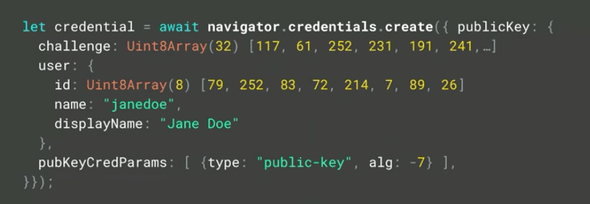

# WebAuthn

Authentication包含两个步骤： register & login

## Register

总的思路是： 

Client 发起request， 服务器生成一个challenge和userId， challenge是为验证公钥真实性（为啥不直接签名公钥呢，是为了区分user吗？）， 

``` js
const res = {
	rp: {
		name: 'auth.obeta.me',
	},
	user: {
		name: 'zhouyuexie',
		id: 'aNZj4B70MQGMBiYcS_Kt-w', // userId, 需要转换为TypedArray,也就是Unit8Array，在下面转换
		displayName: 'zhouyuexie',
	},
```

Client接收到challenge后，浏览器提示用户进行Authentication，一般是指纹，pin码这些，然后Authenticator生成新的公钥-私钥对，存储私钥， 用户信息，域名，然后用私钥对challenge解码后的数据进行签名，然后发起新的request：

``` js
		'ulLqvWUgm28Efb-hVW1w38XW9CxJ9FEOs57ZgH7qkMmQpwSGutKlSo1Zs1fEvBw7z0XGwtRyfntdAqQKlxWJ9w', // challenge, 需要转换为TypedArray,也就是Unit8Array，在下面转换
	pubKeyCredParams: [
		{
			type: 'public-key', // ES256 加密
			alg: -7,
		},
		{
			type: 'public-key', // RS256 加密
			alg: -257,
		},
	],
	authenticatorSelection: {
		requireResidentKey: true, // 是否支持无密码注册登录（注意目前阶段大部分手机设备不支持，因此使用手机注册登录会设置为false）
		// Select authenticators that have a second factor (e.g. PIN, Bio)
		userVerification: 'required',
		// Selects between bound or detachable authenticators
		authenticatorAttachment: 'platform',
	},
	timeout: 60000,
	attestation: 'direct',
};
// 拿到response后在进行下一步之前,我们js还需要对其中的id,challenge进行处理成ArrayBuffer
res.user.id = base64url.decode(res.user.id);
res.challenge = base64url.decode(res.challenge);
// base64url 引用于 https://github.com/herrjemand/Base64URL-ArrayBuffer
```

发起Request的数据：




## Login

1. 输入user id ， 以后登陆的时候，服务器用userId就可以找到公钥
2. 和register的流程一样，后端用公钥解密即可达成登陆。

## Example - js

[1 Webauthn-example](https://github.com/MicrosoftEdge/webauthnsample)


## 参考文章

[主要参考 1 ](https://obeta.me/posts/2019-03-01/WebAuthn%E4%BB%8B%E7%BB%8D%E4%B8%8E%E4%BD%BF%E7%94%A8)